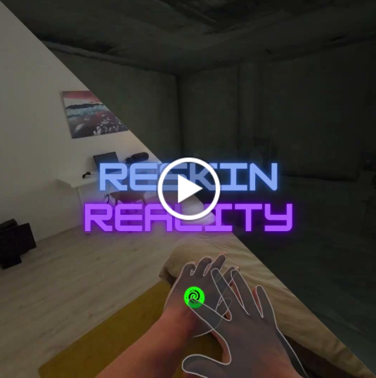
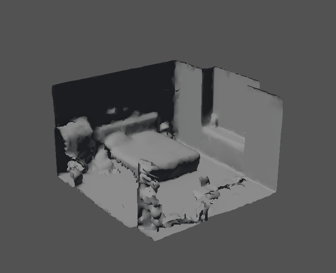
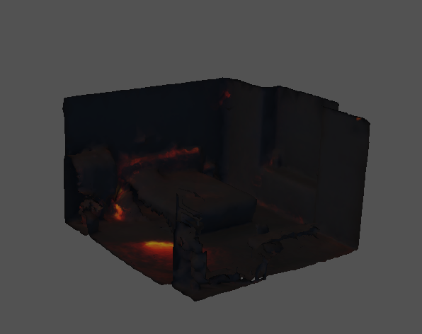

## Idea
This prototype uses AI to reskin real environments with custom visuals, transforming walls, furniture, and objects into immersive mixed reality elements. By scanning surfaces and generating textures from text, it blends physical and digital worlds without hiding real items. It showcases how AI and spatial computing can turn any room into a personal fantasy or branded experience—effortlessly and creatively.

## Trailer

## Features
### Core features
- Surface Scanning and Mapping
    
    Detect and scan key surfaces in the real world (e.g., environment and furniture) to create mesh representations.
    
- Prompt-Based Texture Generation
    
    Allow users to input a text prompt to generate textures using an AI model.
    
- Real-Time Texture Application
    
    Automatically apply the generated textures to the scanned meshes, matching their shape and orientation.
    
- Persistent Texture Anchoring
    
    Keep textures accurately anchored to their real-world surfaces, maintaining alignment as the user moves.

Stretch goals
- Physical Object Integration
    
    Recognize common household objects (e.g., chairs, tables) and give them thematic makeovers, like turning a chair into a throne.
    
- Voice Command Integration
    
    Let users describe how they want the environment to look using voice input instead of text prompts.

## Tech stack
- MRUK (Getting world mesh)
- A mesh exporter
- Meshy (Creating texture for mesh) maybe a own server and model if possible in this time
- Mesh importer (superposition meshes)

## Resources / Inspiration
I got inspired by a video like this one: Apple Vision Pro “reskin reality” demo (https://www.facebook.com/Gadgets90Official/videos/apple-vision-pro-lets-you-put-a-skin-on-your-reality-/1670906157182260/), which imagines how we might completely change the look of our physical environment using AR. While visually striking, there was never an actual working version shown. And based on my experience, I suspect the video was pre-rendered rather than running in real time.

We’re not quite at that level yet, but I believe it’s already possible to build a simplified version of this concept with the tools we have today. That’s why I want to prototype a real, working version that explores how we can "reskin reality" in a meaningful, interactive way.
 
Room mesh:  
</a>
 Room mesh with lava texture: 
</a>

## Key learning points
- **Room Mesh Accuracy**: Meta’s room mesh is not accurate enough for high-quality, consistent results. This limited the realism and stability of the final experience.
- **Single-Object Texture Editing**: The ability to scan and retexture a single object would significantly enhance the overall effect. However, this is not trivial to implement and is currently not supported in my prototype.
- **Meshy AI Limitations and Surprises**: Meshy is designed for exterior-to-interior texturing (e.g., 3D scanned objects), not for interior environments viewed from the inside. Still, I was positively surprised by how decent the generated textures looked even in this inverse use case.
- **Mesh Alterations and Reimport Issues**: Meshy tends to alter the geometry of the original mesh, which complicates the reimport process and alignment in the room-scale scene.
- **Time Constraints**: With just one week, I had to simplify or manually implement parts of the experience that could otherwise be automated (e.g., interaction triggers, occlusion handling). With 1–2 additional weeks, the prototype could reach a much higher level of polish and functionality.

In summary, the prototype validated the potential of the concept, though technical and temporal constraints limited full realization. With further refinement, this approach could offer a compelling new way to reimagine physical environments through AR.